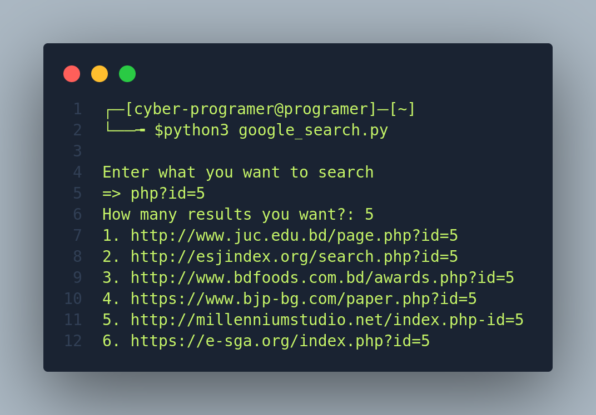

<p align="center">
  
</p>
#  Google Search Assistant for Google Dorking

### Overview:
The Google Search Assistant for Google Dorking is a Python tool designed to help users perform advanced Google searches, also known as Google dorking, to discover specific information and vulnerabilities on the internet. This tool simplifies the process of crafting custom search queries and retrieving relevant search results.

### Features:

- Customized Google Searches: Users can input their search queries, including advanced operators and filters, to target specific information on the web.

- Result Quantity Control: The tool allows users to specify the number of search results they want to retrieve, helping them focus on the most relevant findings.

- User-Friendly Interface: The user interface is straightforward, making it accessible to both beginners and experienced users.

<p align="center">
  
</p>

### How to Use:
```
  apt update -y
  apt upgrade -y
  apt install python -y
  git clone https://github.com/Cyber-Programer/Google-Search.git
  cd Google-Search
  python3 google_search.py
```
- Run the tool by executing the `google_search.py` script in your terminal or command prompt.

- Enter your desired search query. For Google dorking, you can use operators like inurl:, intext:, filetype:, etc., to refine your search.

- Specify the number of search results you want to obtain.

- The tool will perform the Google search based on your input and display the resu

**Disclaimer:**
This tool is intended for educational and research purposes only. Users are responsible for ensuring their activities comply with applicable laws and regulations. Unauthorized access or use of information is strictly prohibited.
